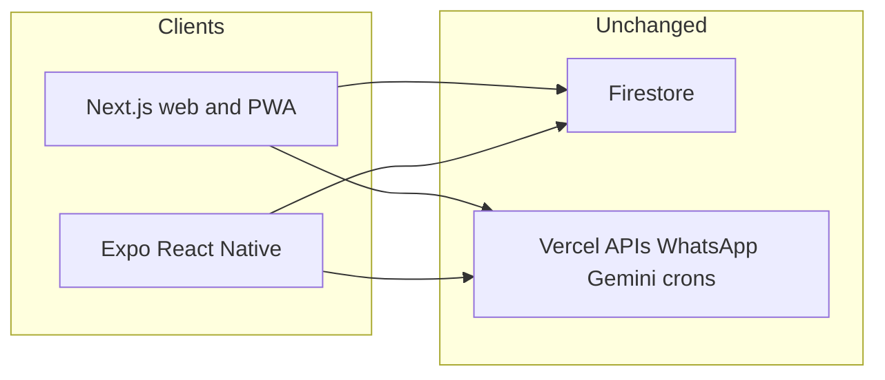

# Shift Align mobile to Expo React Native

## Decision

- **Mobile:** Expo in [`align-native/`](align-native/) becomes the iOS/Android app (replaces Capacitor over time).
- **Keep:** Next.js web UI, Vercel APIs, Gemini parse, WhatsApp webhook, and crons. Same Firestore (`planner_items` keyed by `ownerId` phone).
- **Do not** delete [`ios/`](ios/), [`android/`](android/), or Capacitor until Daily + a second tab feel trustworthy. Ship two clients for a while.

The hard part is UI, not backend. Almost the whole product lives in [`app/page.tsx`](app/page.tsx) (~2.1k lines) plus [`app/globals.css`](app/globals.css). That does not port; we rebuild screens in RN. WhatsApp, parse, and rollover stay on the server.

## Why this works for Align

Today “native” is a WebView plus haptics, local notifications, biometrics, splash, and OTA ([`lib/native.ts`](lib/native.ts), [`capacitor.config.ts`](capacitor.config.ts)). There are no widgets, Live Activities, or in-app camera. Expo maps those plugins 1:1 later.

Identity is **not** Firebase Auth. Login is a WhatsApp number stored as `planner_user_phone`, then items filter `ownerId == phone` ([`app/page.tsx`](app/page.tsx) around the login form and the `planner_items` snapshot). Expo must use the **same** digit string so existing users see the same timeline.

## First slice (this work)

Build a real Align client inside [`align-native/`](align-native/), not the Expo Home/Explore template.

**In scope**
1. Persist phone in AsyncStorage (`planner_user_phone`), same normalize rules as web (`digits` only, country code required).
2. Login screen: Align title, tel input, Continue.
3. Firestore JS SDK (same project as [`lib/firebase.ts`](lib/firebase.ts)) with persistence if available; subscribe `planner_items` where `ownerId == phone`.
4. Daily screen: day strip, tasks for that date (anytime + timed), toggle `done`, add a title (+ optional time/date), delete.
5. Native tabs: Daily only for now (Calendar/Finance/Goals as placeholders or hidden).

**Out of scope for slice 1:** PIN/Face ID, drawer, AI parse, voice, calendar/finance/goals, WhatsApp settings, local notifications, OTA, removing Capacitor.

**Feel:** Match Align’s iOS-ish density (large title, grouped lists, blue accent) with RN `StyleSheet` / tokens in [`align-native/src/constants/theme.ts`](align-native/src/constants/theme.ts). Do not wrap the Next.js site in a WebView.

### Suggested files

- `align-native/src/lib/firebase.ts` — init + `db`
- `align-native/src/lib/phone.ts` — `normalizePhone` / `formatPhone`
- `align-native/src/lib/storage.ts` — AsyncStorage wrapper
- `align-native/src/app/index.tsx` — Daily (or `_layout` gate: no phone → login route)
- `align-native/src/app/login.tsx` — phone entry
- Keep [`app.json`](align-native/app.json) but rename display name / scheme toward Align (`com.planner.alignapp` when you add a native `bundleIdentifier`)

Config: Expo `app.config` extra / env for Firebase keys (do not rely on Next `NEXT_PUBLIC_*`). Same project id `planner-app-3471f`. Prefer env over copying hardcoded fallbacks long-term; for the spike, matching the existing client config is enough to sync real data.

## After slice 1 (not this PR)

Ordered parity: Calendar → Finance (incl. splits / `wa.me`) → Goals → lock ([`lib/auth.ts`](lib/auth.ts) + [`components/LockScreen`](components/LockScreen)) → settings → scheduled local notifications (replace the web 10s poll) → App Store identity / EAS. Then retire Capacitor when you stop needing OTA-on-WebView.

Optional later: a small shared `packages/align-domain` for date helpers and item types. Do not extract that before Daily works.

## Explicit non-goals

- Sharing Tailwind / DOM / Framer components with Expo
- Rewriting WhatsApp or cron routes
- Big-bang feature parity before login + Daily read/write is proven on a real phone number
